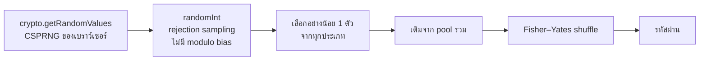

# 🔐 KANAO Password Generator

[](https://github.com/adisorn6302565/KANAO-Password-Generator/actions/workflows/pages.yml)


เว็บสร้าง **รหัสผ่าน** และ **คีย์ลับ (Hex / Base64)** แบบสุ่มที่ปลอดภัย ทำงานในเบราว์เซอร์ทั้งหมด ไม่ส่งข้อมูลออกไปไหน

## 🌐 ใช้งานออนไลน์

**https://adisorn6302565.github.io/KANAO-Password-Generator/**

เปิดบนมือถือแล้วกด "เพิ่มลงหน้าจอหลัก" ใช้เหมือนแอปได้

## ✨ ฟีเจอร์

- รหัสผ่านความยาว 4–64 ตัว เลือกได้: ตัวพิมพ์ใหญ่ / เล็ก / ตัวเลข / สัญลักษณ์ / ตัดตัวที่สับสนง่าย (`0 O I l 1`)
- **รับประกันว่ามีทุกประเภทที่เลือก** อย่างน้อย 1 ตัว
- คีย์ลับแบบ Hex / Base64 (ใช้ทำ API secret, JWT secret, encryption key)
- ความแข็งแรงคำนวณจาก **entropy (bits)**: < 50 อ่อน, < 80 ปานกลาง, ≥ 80 แข็งแกร่ง
- คัดลอกด้วยคลิกเดียว

## 🔒 ความปลอดภัย



- ใช้ `crypto.getRandomValues` (CSPRNG) ไม่ใช้ `Math.random`
- ทุกอย่างถูก build รวมเป็นไฟล์ static ไม่มีสคริปต์จาก CDN ภายนอก (ยกเว้นฟอนต์ Google Fonts)
- ไม่มี backend, ไม่มี analytics, ไม่บันทึกรหัสที่สร้าง

## 💻 รันในเครื่อง

ต้องมี [Node.js 20+](https://nodejs.org/)

```bash
npm install
npm run dev      # http://localhost:3000
npm run build    # ได้ไฟล์ static ใน dist/ (เปิดจากโฮสต์ไหนก็ได้)
```

**Deploy:** push เข้า `main` → GitHub Actions build และขึ้น GitHub Pages อัตโนมัติ

## 🧩 โครงสร้าง

```text
├── App.tsx
├── components/
│   ├── PasswordGenerator.tsx   # UI
│   └── ParticleBackground.tsx
├── utils/generatorLogic.ts     # สุ่ม / entropy
├── index.css                   # Tailwind
└── .github/workflows/pages.yml
```

## 🆕 v1.1

- แก้ **modulo bias** (`x % n` ทำให้ตัวอักษรบางตัวออกบ่อยกว่า) ด้วย rejection sampling
- รับประกันว่ามีครบทุกประเภทที่เลือก (เดิมอาจไม่มีตัวเลขเลยแม้ติ๊กไว้)
- ความแข็งแรงคำนวณจาก entropy จริง แสดงเป็น bits
- เลิกโหลด Tailwind / React จาก CDN ตอนรัน (เดิมเสี่ยง supply-chain และใช้ offline ไม่ได้) เปลี่ยนเป็น build ปกติ
- Deploy GitHub Pages อัตโนมัติ

## 📜 License

MIT
